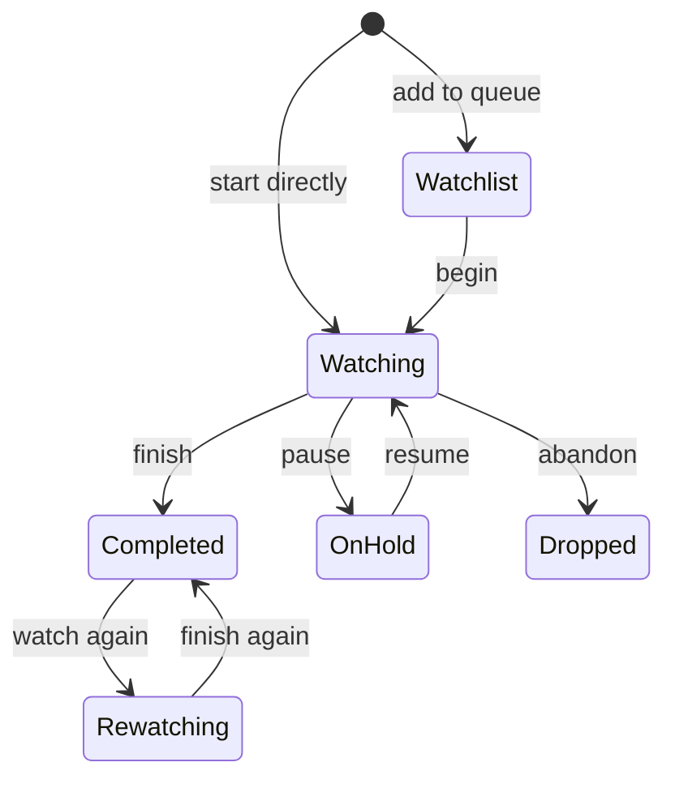
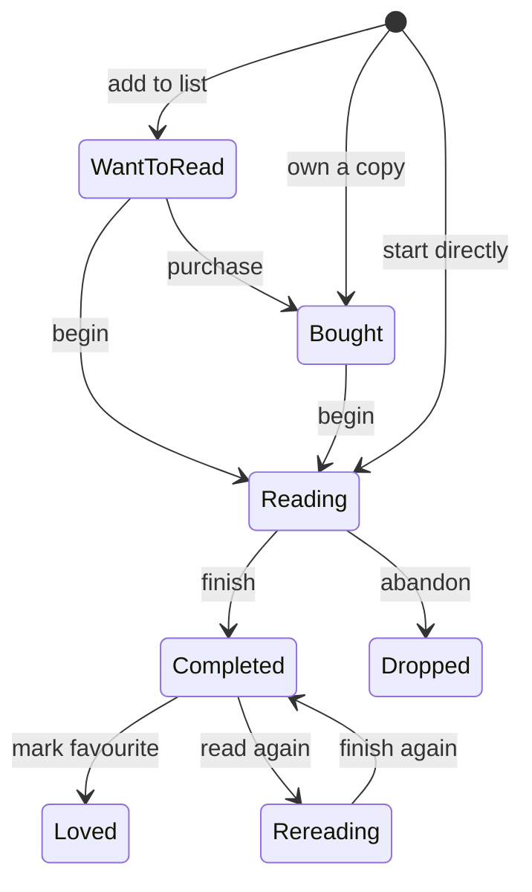
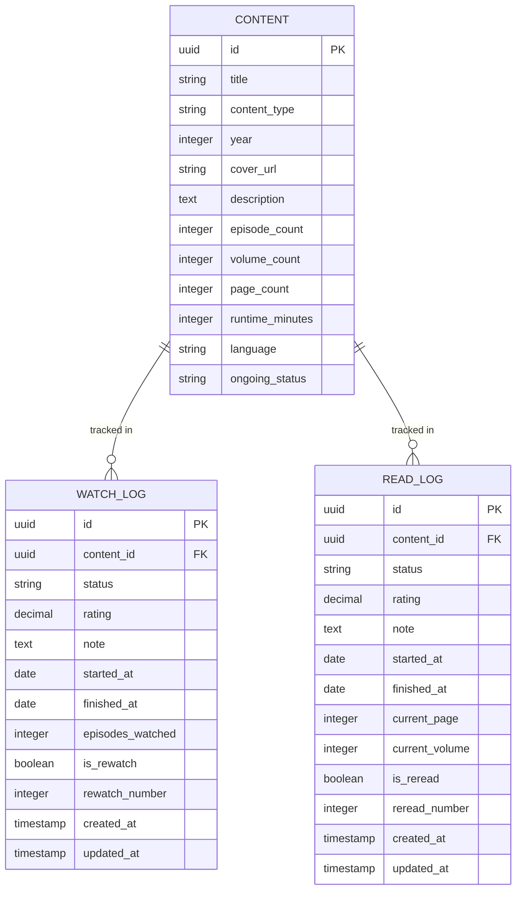
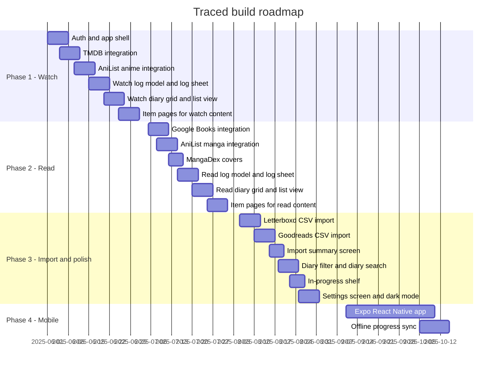

# Traced — Product Requirements Document
### Version 2.0 | Personal Media Logging App

---

## Table of Contents

1. [Product Overview](#1-product-overview)
2. [Problem Statement](#2-problem-statement)
3. [Goals](#3-goals)
4. [What This App Is Not](#4-what-this-app-is-not)
5. [Content Types](#5-content-types)
6. [Watch Section — Statuses & Log Model](#6-watch-section--statuses--log-model)
7. [Read Section — Statuses & Log Model](#7-read-section--statuses--log-model)
8. [Core Features](#8-core-features)
9. [Screen Inventory](#9-screen-inventory)
10. [Data Model](#10-data-model)
11. [External API Integrations](#11-external-api-integrations)
12. [Import — CSV](#12-import--csv)
13. [Tech Stack & Architecture](#13-tech-stack--architecture)
14. [User Flows](#14-user-flows)
15. [Non-Functional Requirements](#15-non-functional-requirements)
16. [Build Phases & Roadmap](#16-build-phases--roadmap)
17. [Out of Scope](#17-out-of-scope)

---

## 1. Product Overview

**Traced** is a personal media logging app — built for one user — to track everything they watch and read. It has two clearly separated sections: **Watch** and **Read**. Within each section, the user can log items, set statuses, rate them, write short notes, and track progress.

There are no public profiles, no social feeds, no followers, no sharing. It is a private diary for media consumption, with a clean and fast UI.

---

## 2. Problem Statement

Tracking what you watch and read across different apps is fragmented and annoying:

- Letterboxd only covers films
- Goodreads only covers books, and its UI is outdated
- AniList / MAL only covers anime and manga
- None of them talk to each other

The goal is one simple app with two sections — Watch and Read — where everything lives together, without the noise of social features, public profiles, or analytics dashboards.

---

## 3. Goals

- Log any watchable or readable item in under 10 seconds
- Know at a glance what you are currently watching, reading, and what is next in queue
- Rate items and write short notes for personal memory
- Import an existing Letterboxd or Goodreads list via CSV to seed the app
- Track episode and page/volume progress for ongoing series and books

---

## 4. What This App Is Not

This is a **personal, private** tool. The following are deliberately excluded:

- No public profiles
- No social feed or followers
- No lists or collections
- No stats or insights dashboard
- No year in review
- No streak tracking
- No data export of any kind
- No sharing or embeds
- No notifications

---

## 5. Content Types

### 5.1 Watch section

| Type | Notes |
|---|---|
| Movie | Any film — theatrical, streaming, short |
| TV Show | Episodic series, any country |
| Web Series | YouTube originals, streaming exclusives |
| Anime Series | TV anime, OVAs, ONAs |
| Anime Movie | Standalone animated feature films |
| Documentary | Feature docs and documentary series |
| Mini-series | Limited series |

**Data source:** TMDB for all live-action. AniList for anime.

### 5.2 Read section

| Type | Notes |
|---|---|
| Book | Fiction, non-fiction, all genres |
| Light Novel | Japanese light novels |
| Manga | Japanese comics — serialised and collected |
| Manhwa | Korean webtoons and print comics |
| Manhua | Chinese comics |
| Graphic Novel | Western long-form comics |
| Comic | Serialised western comics |

**Data source:** Google Books + Open Library for books. AniList + MangaDex for manga/manhwa/manhua.

### 5.3 Shared content card fields

Every item stored in the database carries these fields regardless of type:

```
id               — uuid PK
title            — string
content_type     — enum (all types above)
year             — integer
end_year         — integer | null
genres           — string[]
language         — string
country          — string[]
creators         — { role: string, name: string }[]
cover_url        — string
description      — text
episode_count    — integer | null   (series only)
volume_count     — integer | null   (manga/manhwa only)
page_count       — integer | null   (books only)
runtime_minutes  — integer | null   (films only)
external_ids     — { tmdb_id, anilist_id, google_books_id,
                     open_library_id, mangadex_id }
ongoing_status   — "ongoing" | "completed" | "cancelled" | "hiatus"
```

---

## 6. Watch Section — Statuses & Log Model

### 6.1 Watch statuses



| Status | Meaning |
|---|---|
| **Watchlist** | Saved, not started yet |
| **Watching** | Currently in progress |
| **Completed** | Fully finished |
| **On hold** | Started but paused |
| **Dropped** | Abandoned, will not continue |
| **Rewatching** | Seen before, currently watching again |

### 6.2 Watch log entry fields

```
id                — uuid PK
content_id        — uuid FK → content
status            — watch status enum
rating            — decimal 0.5–5.0 (half-star) | null
note              — text | null  (500 character max)
started_at        — date | null
finished_at       — date | null
episodes_watched  — integer | null
is_rewatch        — boolean
rewatch_number    — integer | null
created_at        — timestamp
updated_at        — timestamp
```

---

## 7. Read Section — Statuses & Log Model

### 7.1 Read statuses



| Status | Meaning |
|---|---|
| **Want to read** | On the list, not started |
| **Bought / Owned** | Physical copy in hand, not started |
| **Reading** | Currently in progress |
| **Completed** | Fully finished |
| **Dropped** | Abandoned, will not continue |
| **Loved** | Completed and marked as a personal favourite |
| **Rereading** | Read before, currently reading again |

### 7.2 Read log entry fields

```
id               — uuid PK
content_id       — uuid FK → content
status           — read status enum
rating           — decimal 0.5–5.0 (half-star) | null
note             — text | null  (500 character max)
started_at       — date | null
finished_at      — date | null
current_page     — integer | null
current_volume   — integer | null
is_reread        — boolean
reread_number    — integer | null
created_at       — timestamp
updated_at       — timestamp
```

---

## 8. Core Features

### 8.1 Two-section navigation

The app has a persistent bottom navigation (mobile) or sidebar (desktop) with exactly two main sections:

- **Watch** — all watchable content
- **Read** — all readable content

Each section is fully independent in terms of filtering, browsing, and display. Switching between them is instant.

### 8.2 Quick logging

The primary action in the app. From any item page, a single tap opens the log sheet — a bottom drawer or modal containing:

- Status selector (the relevant status list for Watch or Read)
- Star rating (half-star tap targets on a 5-star row)
- Note field (plain text area, 500 character max)
- Date started / date finished (optional date pickers)
- Progress field — episodes watched (Watch) or current page + current volume (Read)

The user can save a log entry with just a status set. Rating and note are always optional.

### 8.3 Diary view (per section)

The main view inside each section. Shows all logged items as a grid of cover art, sorted by date logged (most recent first). Each card shows:

- Cover / poster image
- Title
- Star rating (if set)
- Status badge
- Progress bar (for Watching / Reading items)

The user can switch between:
- **Grid view** — poster wall, dense, visual
- **List view** — one item per row with more metadata visible (title, status, rating, dates)

### 8.4 Filtering the diary

Within each section the user can filter by:

- Status (e.g. show only Completed, or only Watching)
- Content type (e.g. only Anime Series, only Manga)
- Rating (e.g. only 4 stars and above)
- Year finished (e.g. everything finished in 2024)

Filters are combinable. A clear button resets all active filters.

### 8.5 Search and item pages

**Search:** A search bar at the top of each section queries the relevant external APIs. Results appear as a scrollable grid of cover cards. Tapping a result opens the item page.

**Item page contains:**

```
Cover image (large)
Title, year, type badge
Genre tags
Creator credits (director / author / studio)
Description
Your current log status + rating, or "Not logged yet" prompt
Progress bar (if Watching or Reading)
Your note (if written)
Episode count / volume count / page count
Similar titles (from the same API)
```

Tapping the status area anywhere on the item page opens the log sheet.

### 8.6 In-progress shelf

At the top of each section's diary, a horizontal scroll shelf shows only items with status **Watching** or **Reading**. This is the "currently active" at-a-glance row. Each card in the shelf shows the progress bar prominently.

### 8.7 Search within your diary

A separate search input within the diary tab lets you search only items you have already logged — useful for quickly finding a specific title without going to the full external search.

### 8.8 CSV import

A one-time or occasional import from Letterboxd (Watch) or Goodreads (Read) via CSV file upload. Full details in Section 12.

---

## 9. Screen Inventory

### 9.1 Navigation structure

```mermaid
graph LR
    "App" --> "Watch section"
    "App" --> "Read section"
    "Watch section" --> "Watch diary"
    "Watch section" --> "Watch search"
    "Watch search" --> "Item page"
    "Watch diary" --> "Item page"
    "Item page" --> "Log sheet"
    "Read section" --> "Read diary"
    "Read section" --> "Read search"
    "Read search" --> "Item page"
    "Read diary" --> "Item page"
    "App" --> "Settings"
    "Settings" --> "Import"
```

### 9.2 Screen list

| Screen | Purpose |
|---|---|
| **Watch diary** | Grid/list of all logged watch items. In-progress shelf at top |
| **Read diary** | Grid/list of all logged read items. In-progress shelf at top |
| **Watch search** | Search TMDB and AniList. Grid of results |
| **Read search** | Search Google Books, Open Library, AniList, MangaDex. Grid of results |
| **Item page** | Detail view — metadata, your current log, similar titles |
| **Log sheet** | Bottom drawer to add or edit a log entry |
| **Settings** | Theme (light/dark), default sort order |
| **Import** | CSV upload flow — choose Letterboxd or Goodreads |
| **Import review** | Summary of matched and unmatched rows after an import |

---

## 10. Data Model



**Schema notes:**

- No `users` table — this is a single-user app. All log entries implicitly belong to the one account
- `CONTENT` is a shared catalogue populated lazily from external APIs on first search
- `WATCH_LOG` and `READ_LOG` are separate tables with different fields and different status enums
- Re-watches and re-reads are new rows, not edits to the existing row — this preserves full diary history

---

## 11. External API Integrations

### 11.1 Integration map

```mermaid
graph LR
    "Traced" --> "TMDB API"
    "Traced" --> "AniList GraphQL"
    "Traced" --> "Google Books API"
    "Traced" --> "Open Library API"
    "Traced" --> "MangaDex API"

    "TMDB API" --> "Movies"
    "TMDB API" --> "TV Shows"
    "TMDB API" --> "Documentaries"
    "TMDB API" --> "Mini-series"
    "TMDB API" --> "Web Series"

    "AniList GraphQL" --> "Anime Series"
    "AniList GraphQL" --> "Anime Movies"
    "AniList GraphQL" --> "Manga"
    "AniList GraphQL" --> "Manhwa"
    "AniList GraphQL" --> "Manhua"
    "AniList GraphQL" --> "Light Novels"

    "Google Books API" --> "Books"
    "Open Library API" --> "Books fallback"
    "MangaDex API" --> "Manga covers"
```

### 11.2 API reference

| API | Free | Rate limit | Used for |
|---|---|---|---|
| TMDB | Yes | 50 req/s | Movies, TV, docs, mini-series, web series |
| AniList | Yes | 90 req/min | Anime, manga, manhwa, manhua, light novels |
| Google Books | Yes (API key) | 1000 req/day | Books |
| Open Library | Yes | Generous | Books fallback when Google Books has no result |
| MangaDex | Yes | 5 req/s | Manga/manhwa cover images and volume metadata |

### 11.3 Caching strategy

- Search results cached in Redis for **10 minutes**
- Individual content metadata saved in the local `CONTENT` table and refreshed every **7 days** on next access
- Cover images fetched once, stored in **Cloudflare R2**, served from CDN indefinitely — never re-fetched from the source API

---

## 12. Import — CSV

### 12.1 Supported sources

| Source | How to export | Fields used |
|---|---|---|
| Letterboxd | letterboxd.com → Settings → Import & Export → Export your data | Title, year, rating, watched date, watchlist flag |
| Goodreads | goodreads.com → My Books → Import and Export → Export Library | Title, author, rating, shelf (read/to-read/currently-reading), date read |

### 12.2 Import flow

```mermaid
flowchart LR
    "Settings → Import" --> "Choose source"
    "Choose source" -->|"Letterboxd"| "Upload CSV"
    "Choose source" -->|"Goodreads"| "Upload CSV"
    "Upload CSV" --> "Parse rows"
    "Parse rows" --> "Lookup each title via API"
    "Lookup each title via API" -->|"Match found"| "Create log entry"
    "Lookup each title via API" -->|"No match"| "Add to unmatched list"
    "Create log entry" --> "Import summary screen"
    "Add to unmatched list" --> "Import summary screen"
    "Import summary screen" --> "Review unmatched items"
    "Review unmatched items" --> "Manually search and log remaining"
```

### 12.3 Status mapping

**Letterboxd → Watch status**

| Letterboxd field | Traced status |
|---|---|
| `watched_date` present | Completed |
| In watchlist only, no watched date | Watchlist |
| Rating present, no explicit watched date | Completed (inferred) |

**Goodreads → Read status**

| Goodreads shelf | Traced status |
|---|---|
| read | Completed |
| currently-reading | Reading |
| to-read | Want to read |

### 12.4 Import rules

- If a CSV row matches an item already logged in Traced (by external ID), it is skipped — no duplicates
- Ratings are imported as-is. Both Letterboxd (0.5–5) and Goodreads (1–5) map directly to Traced's scale
- Review text from the source CSV is imported into the `note` field, truncated to 500 characters if longer
- Import under 200 rows runs synchronously. Larger files run as a background job
- After import, the summary screen shows: X imported, Y skipped (already logged), Z could not be matched

---

## 13. Tech Stack & Architecture

### 13.1 Architecture overview

```mermaid
graph LR
    "Browser / Mobile" --> "Next.js App"
    "Next.js App" --> "API Routes"
    "API Routes" --> "PostgreSQL"
    "API Routes" --> "Redis cache"
    "API Routes" --> "TMDB"
    "API Routes" --> "AniList"
    "API Routes" --> "Google Books"
    "API Routes" --> "MangaDex"
    "API Routes" --> "Cloudflare R2"
```

### 13.2 Stack

| Layer | Choice | Reason |
|---|---|---|
| Framework | Next.js 14 (App Router) | Full-stack in one repo, SSR for fast item pages |
| Language | TypeScript | Type safety end-to-end |
| Styling | Tailwind CSS | Fast, consistent, dark mode built in |
| Data fetching | TanStack Query | Caching, optimistic updates, background refetch |
| ORM | Prisma | Type-safe queries, clean schema migrations |
| Database | PostgreSQL (Neon or Supabase free tier) | Relational, reliable, scales if needed |
| Cache | Redis (Upstash free tier) | API response caching |
| Auth | NextAuth.js | Single user — email/password is sufficient |
| Cover storage | Cloudflare R2 | Cheap CDN for cover images |
| Deploy | Vercel | Zero-config, generous free tier for personal apps |
| Mobile (Phase 4) | Expo (React Native) | Share logic with web, native feel |

### 13.3 Single-user simplification

Because this app is for one user, several concerns that apply to multi-user apps are simply gone:

- No user ID foreign keys on log tables
- No row-level security or tenant scoping
- Auth is a simple session gate — if the session is valid, full read and write access
- Database will stay small (a few thousand rows at most) — no scaling concerns at all
- No need for a separate background job queue — background processing can run in a Next.js API route with a simple async handler

---

## 14. User Flows

### 14.1 Logging a new item

```mermaid
flowchart LR
    "Tap search" --> "Type title"
    "Type title" --> "Results from API"
    "Results from API" --> "Tap item"
    "Tap item" --> "In local DB?"
    "In local DB?" -->|"No"| "Fetch from API and save to content table"
    "In local DB?" -->|"Yes"| "Load from local DB"
    "Fetch from API and save to content table" --> "Item page"
    "Load from local DB" --> "Item page"
    "Item page" --> "Tap log button"
    "Tap log button" --> "Log sheet opens"
    "Log sheet opens" --> "Set status"
    "Set status" --> "Set rating (optional)"
    "Set rating (optional)" --> "Write note (optional)"
    "Write note (optional)" --> "Save"
    "Save" --> "Diary updates"
```

### 14.2 Updating progress on an ongoing item

```mermaid
flowchart LR
    "Open Watch or Read section" --> "In-progress shelf"
    "In-progress shelf" --> "Tap item"
    "Tap item" --> "Item page"
    "Item page" --> "Tap progress"
    "Tap progress" --> "Update episodes or page number"
    "Update episodes or page number" --> "Save"
    "Save" --> "Progress bar updates on card"
    "Save" --> "All episodes done?"
    "All episodes done?" -->|"Yes"| "Prompt to mark Completed"
    "All episodes done?" -->|"No"| "Stay as Watching"
```

### 14.3 CSV import

```mermaid
flowchart LR
    "Settings → Import" --> "Choose Letterboxd or Goodreads"
    "Choose Letterboxd or Goodreads" --> "Upload CSV file"
    "Upload CSV file" --> "Parse each row"
    "Parse each row" --> "API lookup by title"
    "API lookup by title" -->|"Match"| "Create log entry with status + rating"
    "API lookup by title" -->|"No match"| "Flag as unmatched"
    "Create log entry with status + rating" --> "Import summary screen"
    "Flag as unmatched" --> "Import summary screen"
    "Import summary screen" --> "See unmatched titles"
    "See unmatched titles" --> "Search and log manually"
```

---

## 15. Non-Functional Requirements

### 15.1 Performance

| Action | Target |
|---|---|
| Diary loads | < 300ms |
| Search results appear | < 600ms |
| Log entry saves | < 200ms |
| Cover images load | < 800ms (CDN-served) |
| CSV import under 200 rows | < 30 seconds |

### 15.2 Offline behaviour

- Diary is readable offline (cached by browser / Expo persistent cache on mobile)
- Search and logging require a network connection — show a clear offline indicator rather than a broken state
- Progress updates on mobile queue locally and sync when back online (Phase 4)

### 15.3 Data safety

- PostgreSQL daily automated backups via Neon or Supabase
- Uploaded CSV files are processed and immediately discarded — not stored permanently
- No user data sent to third parties except the title strings used to query content APIs

### 15.4 Accessibility

- WCAG 2.1 AA compliance
- All interactive elements keyboard-navigable
- Meaningful alt text on all cover images
- Dark and light mode support — follows system preference by default, overridable in settings

---

## 16. Build Phases & Roadmap



### Phase 1 — Watch section (weeks 1–6)

The user can search for any film or anime, log it with a status and optional rating, track episode progress, and view a diary of everything logged.

- App shell with auth (email/password, single account)
- TMDB integration — movies, TV shows, documentaries, mini-series, web series
- AniList integration — anime series and anime movies
- Watch log model — status, rating, note, dates, episode progress
- Log sheet (bottom drawer)
- Watch diary — grid view, list view, filter by status and type
- Item pages for all watch content types
- In-progress shelf on watch diary

### Phase 2 — Read section (weeks 7–10)

Mirror of Phase 1 for all readable content.

- Google Books and Open Library integration — books, light novels
- AniList integration — manga, manhwa, manhua
- MangaDex for cover images and volume metadata
- Read log model — status, rating, note, dates, page and volume progress
- Log sheet with read-specific fields
- Read diary — grid view, list view, filter by status and type
- Item pages for all read content types
- In-progress shelf on read diary

### Phase 3 — Import and polish (weeks 11–14)

Import existing data and tighten up the UI.

- Letterboxd CSV import → Watch log entries
- Goodreads CSV import → Read log entries
- Import summary and unmatched items review screen
- Diary search (search within already-logged items)
- Combined filter support (status + type + rating range)
- Settings screen (theme toggle, default sort order)
- Full dark mode pass and UI polish

### Phase 4 — Mobile app (weeks 15–20)

A native mobile experience using Expo that connects to the same backend.

- Expo React Native app — Watch and Read sections, full parity with web
- Offline diary reading
- Progress update queue when offline, sync on reconnect
- Native log sheet with swipe-to-dismiss gesture

---

## 17. Out of Scope

| Feature | Why excluded |
|---|---|
| Public profiles | Personal-only app |
| Social feed / followers | Personal-only app |
| Lists and collections | Adds complexity, not needed |
| Stats and insights dashboard | Not a priority |
| Year in review | Not needed yet |
| Streak tracking | Not needed |
| Data export (CSV, PDF, JSON) | Not needed |
| Push or email notifications | Nothing to notify about |
| Recommendations engine | Revisit later if wanted |
| MAL or AniList account import | CSV only — API auth adds unnecessary complexity |
| Podcast tracking | Different product |
| Music tracking | Different product |
| Multiple user accounts | Single-user app |
| Browser extension | Phase 4+ at earliest |

---

*Document version 2.0 — simplified for personal single-user use. Replaces v1.0.*
