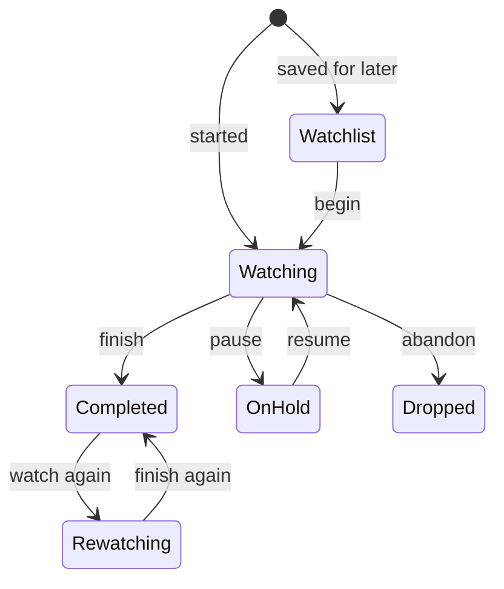
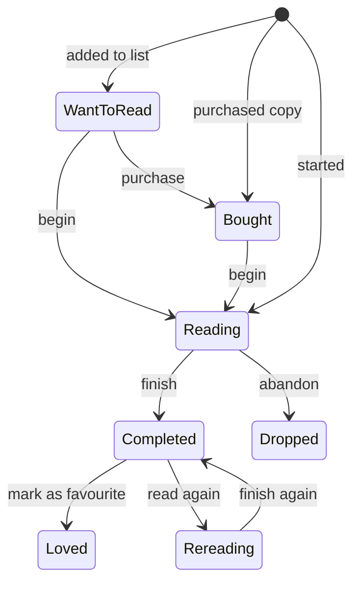
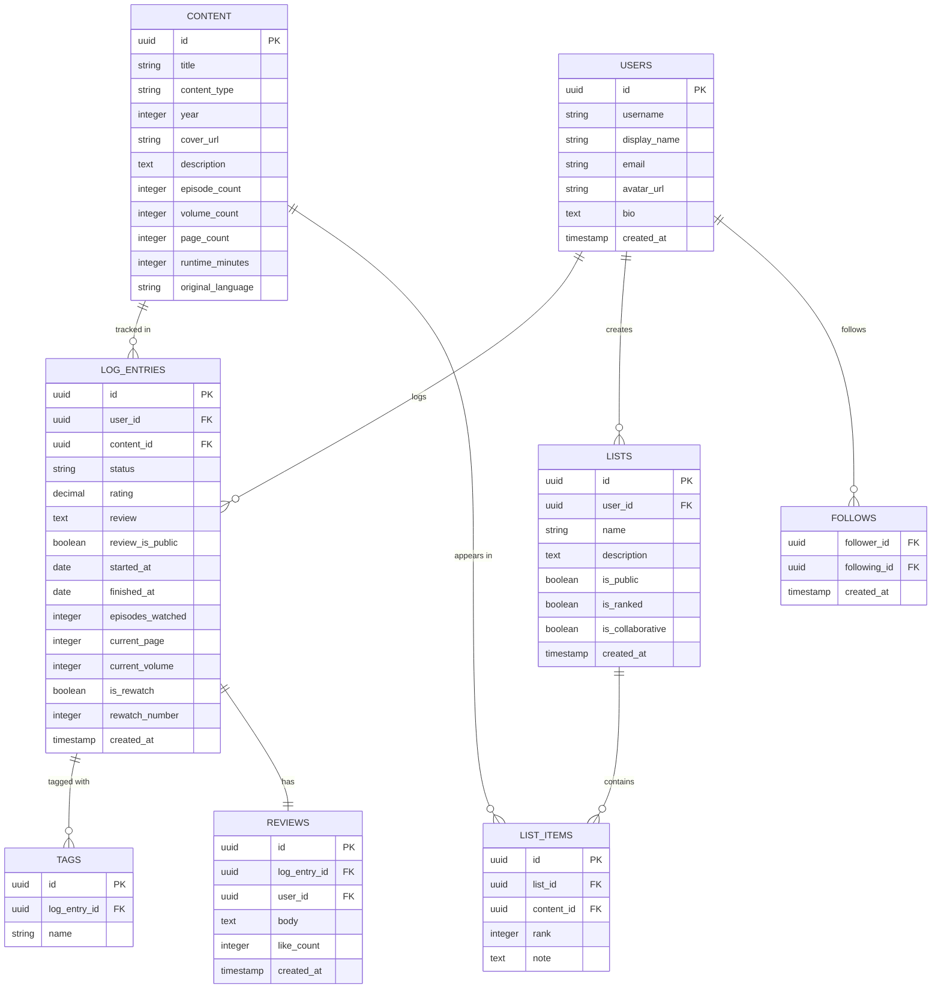
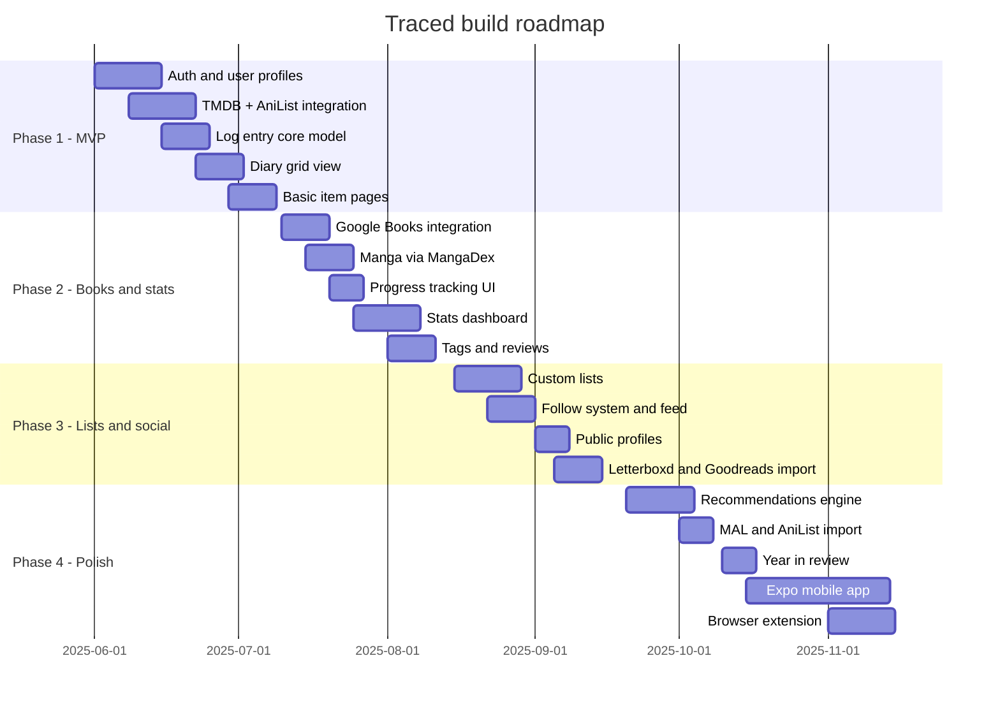

# Traced — Product Requirements Document
### Version 1.0 | Media Logging App (Letterboxd × Goodreads)

---

## Table of Contents

1. [Product Overview](#1-product-overview)
2. [Problem Statement](#2-problem-statement)
3. [Goals & Success Metrics](#3-goals--success-metrics)
4. [Target Users](#4-target-users)
5. [Content Types](#5-content-types)
6. [Statuses & Log Entry Model](#6-statuses--log-entry-model)
7. [Core Features](#7-core-features)
8. [Screen Inventory](#8-screen-inventory)
9. [Data Model](#9-data-model)
10. [External API Integrations](#10-external-api-integrations)
11. [Tech Stack & Architecture](#11-tech-stack--architecture)
12. [User Flows](#12-user-flows)
13. [Non-Functional Requirements](#13-non-functional-requirements)
14. [Build Phases & Roadmap](#14-build-phases--roadmap)
15. [Out of Scope](#15-out-of-scope)

---

## 1. Product Overview

**Traced** is a unified media logging app that lets users track everything they watch and read in one place. It combines the film-diary experience of Letterboxd with the book-tracking experience of Goodreads — but extends both to cover the full spectrum of watchable and readable content: anime, manga, documentaries, graphic novels, and more.

The core promise: *one app to log your entire media life.*

---

## 2. Problem Statement

Today, a person who watches movies, follows anime, reads books, and collects manga needs at minimum three separate apps to track their media consumption:

- **Letterboxd** for movies
- **Goodreads** for books
- **MyAnimeList or AniList** for anime and manga

None of these talk to each other. Stats are fragmented. There is no unified diary, no combined recommendations, and no single profile to share. Users who cross content types — which is most people — are underserved.

**Traced** solves this by being the single source of truth for all media a person consumes.

---

## 3. Goals & Success Metrics

### Product goals

- Allow users to log, rate, and review any watchable or readable content
- Provide meaningful personal stats and a visual diary
- Support import from existing platforms (Letterboxd, Goodreads, MAL)
- Be fast, clean, and opinionated in design — not a bloated aggregator

### Success metrics

| Metric | Target (6 months post-launch) |
|---|---|
| Registered users | 10,000 |
| DAU / MAU ratio | ≥ 25% |
| Avg entries per active user | ≥ 50 |
| Retention (D30) | ≥ 40% |
| Reviews written | ≥ 30% of completed entries |
| Import completion rate | ≥ 70% of users who start an import |

---

## 4. Target Users

### Primary persona — The multi-format media fan
- Age 18–32, watches films + anime, reads manga + books
- Already uses 2–3 separate tracking apps and finds it frustrating
- Cares about ratings, reviews, personal stats, and recommendations
- Moderate to high social media usage; happy to share lists and reviews

### Secondary persona — The book reader
- Primarily reads books and graphic novels
- Frustrated with Goodreads' outdated UI and limited social features
- Wants beautiful cover displays, better stats, and cleaner logging

### Tertiary persona — The anime completionist
- Tracks anime series and manga volumes obsessively
- Needs episode-level progress, volume tracking, and status granularity
- Currently uses AniList or MAL; drawn to Traced by the unified experience

---

## 5. Content Types

### 5.1 Watchable content

| Type | Notes |
|---|---|
| Movies | Theatrical, direct-to-streaming, short films |
| TV Shows | Episodic series, any country |
| Web Series | YouTube Originals, streaming exclusives |
| Anime Series | TV anime, OVAs, ONAs |
| Anime Movies | Standalone animated feature films |
| Documentaries | Feature docs and doc series |
| Mini-series | Limited series, 1–3 seasons |

**Data source:** TMDB for live-action content. AniList for anime.

### 5.2 Readable content

| Type | Notes |
|---|---|
| Books | Fiction, non-fiction, all genres |
| Light Novels | Japanese light novels (often anime-adjacent) |
| Manga | Japanese comics, serialised and collected |
| Manhwa | Korean webtoons and print comics |
| Manhua | Chinese comics |
| Graphic Novels | Western long-form comics |
| Comics | Serialised western comics |

**Data source:** Google Books + Open Library for books. AniList + MangaDex for manga/manhwa/manhua.

### 5.3 Content card — stored fields

Every content item in the system carries:

```
title            — string
content_type     — enum (movie | tv_show | anime_series | anime_movie | documentary
                         | mini_series | web_series | book | light_novel | manga
                         | manhwa | manhua | graphic_novel | comic)
year             — integer (start year for series)
end_year         — integer | null (for completed series)
genres           — string[]
language         — string (original language)
country          — string[]
creators         — { role: "director"|"author"|"studio"|"publisher", name: string }[]
cover_url        — string (poster / book cover)
description      — text
episode_count    — integer | null (for series)
volume_count     — integer | null (for serialised reads)
page_count       — integer | null (for books)
runtime_minutes  — integer | null (for films)
external_ids     — { tmdb_id, anilist_id, google_books_id, open_library_id, mangadex_id }
status           — "ongoing" | "completed" | "cancelled" | "hiatus"
```

---

## 6. Statuses & Log Entry Model

### 6.1 Watch statuses



| Status | Description |
|---|---|
| **Watchlist** | Saved for later; not started |
| **Watching** | Currently in progress |
| **Completed** | Fully finished |
| **On hold** | Started but paused |
| **Dropped** | Abandoned, will not continue |
| **Rewatching** | Seen before, currently watching again |

### 6.2 Read statuses



| Status | Description |
|---|---|
| **Want to read** | On the list; not started |
| **Bought / Owned** | Physical copy in hand; not yet started |
| **Reading** | Currently in progress |
| **Completed** | Fully finished |
| **Dropped** | Abandoned, will not continue |
| **Loved / Favourite** | Completed and marked as a special favourite |
| **Rereading** | Read before, currently reading again |

### 6.3 Log entry schema

A log entry is created when a user adds an item to any status. It is the core data unit of the app.

```
log_entry_id     — uuid PK
user_id          — uuid FK → users
content_id       — uuid FK → content
status           — enum (watch/read statuses above)
rating           — decimal (0.5 – 5.0, half-star increments) | null
review           — text | null
review_is_public — boolean (default true)
started_at       — date | null
finished_at      — date | null
created_at       — timestamp
updated_at       — timestamp
tags             — string[]

-- Progress fields (only relevant fields used per content type)
episodes_watched — integer | null
current_page     — integer | null
current_volume   — integer | null

-- Re-watch / re-read support
is_rewatch       — boolean (default false)
rewatch_number   — integer (1 = first rewatch, etc.)
```

Each time a user rewatches or rereads, a new log entry is created. The diary shows all entries chronologically.

---

## 7. Core Features

### 7.1 Logging & tracking

- **Quick log:** From any item page, a single button opens a log sheet — status, rating, dates, tags
- **Progress updates:** For series, log current episode. For books/manga, log current page and volume. Progress bar shown on item card
- **Half-star ratings:** 0.5–5.0 scale (10 discrete values), matching Letterboxd convention
- **Diary entries:** Each completion creates a diary entry. Re-watches create separate diary entries
- **Tags:** Free-form user-defined tags per entry (#cozy, #rewatch-candidate, #gift-idea)
- **Private entries:** Mark any entry private — it won't appear in your public diary or feed

### 7.2 Profile & diary

- **Profile page:** Avatar, display name, bio, location, website link, join date
- **Public stats bar:** Total watched, total read, total hours, average rating
- **Diary tab:** Chronological feed of all log entries. Switchable between grid (poster wall) and list view
- **Filters:** Filter diary by content type, status, rating range, year logged, year released, genre
- **Year in review:** Auto-generated annual summary — top films, top books, total hours, genre breakdown. Shareable as an image
- **Activity streaks:** Consecutive days with at least one log entry

### 7.3 Discovery & search

- **Global search:** Search across all content types simultaneously. Results grouped by type
- **Advanced filters:** Type, genre, year range, country, language, average rating on Traced
- **Browse pages:** Trending this week (by log volume), Popular all-time, New releases
- **Creator pages:** Director/author/studio/publisher pages showing their full catalogue, filterable by type
- **Genre hubs:** Dedicated genre pages (e.g. Horror, Romance, Shonen) with top-rated and trending items
- **Personalised recommendations:** Based on your 4-star+ rated items, surface similar titles you haven't logged. Updated weekly

### 7.4 Item pages

Every content item has a dedicated page:

```
Header:     Cover/poster | Title | Year | Type | Genres | Runtime/Page count
            Creator credits | External links (TMDB / AniList / Goodreads)
Your log:   Status button | Star rating | Quick review | Progress bar
Stats:      Average rating on Traced | Distribution histogram | Total logs
Reviews:    Sorted by recent / popular. Like and reply to reviews
Similar:    Recommendations pulled from the same API source
Also logged by: Friends who have this in their diary
```

### 7.5 Lists

- **Custom lists:** User creates a named list with optional description. Add any content items to it
- **Ranked lists:** Toggle on ranking mode — items get drag-to-reorder numbers
- **Public / private:** Each list is independently scoped
- **Smart lists:** Auto-populated lists based on filter rules — e.g. "All anime I rated 4 stars or above"
- **Clone / fork:** Any public list can be cloned to your own account as a starting point
- **Embed / share:** Each list has a public URL and an embeddable widget (iframe)
- **Collaborative lists:** Invite other users to contribute to a shared list

### 7.6 Stats & insights

```mermaid
graph LR
    "Log entries" --> "Stats engine"
    "Stats engine" --> "Total counts"
    "Stats engine" --> "Time spent"
    "Stats engine" --> "Genre breakdown"
    "Stats engine" --> "Rating distribution"
    "Stats engine" --> "Completion funnel"
    "Stats engine" --> "Activity heatmap"
    "Stats engine" --> "Top creators"
    "Stats engine" --> "Year in review"
```

| Stat | Description |
|---|---|
| Total watched / read | Counts by content type |
| Hours consumed | Runtime × films watched + avg pages/hour for books |
| Genre breakdown | Pie chart — which genres dominate your taste |
| Rating histogram | Distribution of your ratings (1–5 stars) |
| Average rating | By content type, and overall |
| Completion rate | % of started items you actually finish |
| Activity heatmap | GitHub-style calendar of daily log activity |
| Top directors | Directors you've logged most content from |
| Top authors | Authors you've logged most content from |
| Content by year | How old is the stuff you typically watch/read |

### 7.7 Social features

- **Follow system:** Follow other users; see their logs in your activity feed
- **Activity feed:** Recent logs, new reviews, new lists from people you follow
- **Review interactions:** Like a review, reply with a comment (threaded, 2 levels max)
- **Taste comparison:** View a friend's profile and see % overlap in completed content + avg rating similarity
- **Public profile:** Shareable URL (`traced.app/u/username`). Shows diary, stats, lists, reviews
- **Notifications:** Someone liked your review, followed you, commented on your list

### 7.8 Import & export

| Source | Format | Fields imported |
|---|---|---|
| Letterboxd | CSV export | Films, ratings, reviews, watch dates |
| Goodreads | CSV export | Books, ratings, shelves, review text, dates |
| MyAnimeList | XML export | Anime/manga list, scores, watch status |
| AniList | GraphQL | Anime/manga list, scores, progress |
| **Traced export** | JSON + CSV | Complete data, all fields |

Import runs as a background job. User is emailed when complete. Duplicate detection by external ID match.

---

## 8. Screen Inventory

### 8.1 Navigation structure

```mermaid
graph LR
    "App" --> "Home / Feed"
    "App" --> "Discover"
    "App" --> "Diary"
    "App" --> "Lists"
    "App" --> "Stats"
    "App" --> "Profile"
    "Discover" --> "Search results"
    "Discover" --> "Genre hubs"
    "Discover" --> "Trending"
    "Search results" --> "Item page"
    "Diary" --> "Item page"
    "Item page" --> "Log sheet"
    "Item page" --> "Creator page"
    "Profile" --> "Settings"
    "Profile" --> "Import / Export"
```

### 8.2 Screen descriptions

| Screen | Purpose | Key interactions |
|---|---|---|
| **Home / Feed** | Activity from followed users. Quick-log bar at top | Log something, see what friends are watching |
| **Discover** | Browse + search all content | Search, filter, browse trending |
| **Search results** | Grid of results for a query | Filter by type, click into item page |
| **Item page** | Full detail for a movie/book/etc | Log it, read reviews, see similar |
| **Log sheet** | Modal/drawer to add/edit a log entry | Set status, rate, review, date |
| **Diary** | Your personal chronological feed | Toggle view, filter, jump to item |
| **Lists** | All your lists + discovery of public lists | Create, edit, fork, share |
| **Stats** | Visual stats dashboard | Filter by year, toggle content type |
| **Profile** | Public profile view | View diary, lists, reviews |
| **Settings** | Account, privacy, notifications | Toggle preferences |
| **Import / Export** | Data portability | Upload CSV, track import progress |
| **Creator page** | Director/author profile | Browse their catalogue |
| **Genre hub** | All content in a genre | Filter, sort, discover |
| **Year in review** | Annual summary, shareable | Share as image |

---

## 9. Data Model



---

## 10. External API Integrations

### 10.1 Integration map

```mermaid
graph LR
    "Traced backend" --> "TMDB API"
    "Traced backend" --> "AniList GraphQL"
    "Traced backend" --> "Google Books API"
    "Traced backend" --> "Open Library API"
    "Traced backend" --> "MangaDex API"

    "TMDB API" --> "Movies"
    "TMDB API" --> "TV Shows"
    "TMDB API" --> "Documentaries"
    "TMDB API" --> "Mini-series"

    "AniList GraphQL" --> "Anime Series"
    "AniList GraphQL" --> "Anime Movies"
    "AniList GraphQL" --> "Manga"
    "AniList GraphQL" --> "Manhwa"
    "AniList GraphQL" --> "Manhua"
    "AniList GraphQL" --> "Light Novels"

    "Google Books API" --> "Books"
    "Open Library API" --> "Books"

    "MangaDex API" --> "Manga"
    "MangaDex API" --> "Manhwa"
```

### 10.2 API details

| API | Cost | Rate limit | Primary use |
|---|---|---|---|
| **TMDB** | Free | 50 req/s | Movies, TV, docs |
| **AniList** | Free | 90 req/min | Anime, manga, LN |
| **Google Books** | Free (with key) | 1000 req/day | Books |
| **Open Library** | Free | No hard limit | Books fallback |
| **MangaDex** | Free | 5 req/s | Manga covers, metadata |

### 10.3 Caching strategy

API results are cached in Redis to avoid redundant external calls:

- Search results: 10 minutes TTL
- Individual content metadata: 24 hours TTL
- Cover images: Stored in Cloudflare R2, served via CDN (permanent)

---

## 11. Tech Stack & Architecture

### 11.1 System architecture

```mermaid
graph LR
    "Browser / Mobile" --> "Next.js frontend"
    "Next.js frontend" --> "Next.js API routes"
    "Next.js API routes" --> "PostgreSQL"
    "Next.js API routes" --> "Redis cache"
    "Next.js API routes" --> "External APIs"
    "Next.js API routes" --> "R2 / S3 storage"
    "Next.js frontend" --> "NextAuth.js"
    "NextAuth.js" --> "PostgreSQL"
    "Background jobs" --> "PostgreSQL"
    "Background jobs" --> "External APIs"
    "Email service" --> "Users"
```

### 11.2 Stack decisions

| Layer | Choice | Rationale |
|---|---|---|
| **Framework** | Next.js 14 (App Router) | SSR for item pages (SEO), RSC for performance, API routes for backend |
| **Language** | TypeScript | Type safety across frontend and backend |
| **Styling** | Tailwind CSS | Fast iteration, consistent design tokens |
| **State** | TanStack Query | Server state, caching, optimistic updates |
| **ORM** | Prisma | Type-safe DB queries, migrations, schema-first |
| **Database** | PostgreSQL (Supabase or Neon) | Relational data, JSONB for flexible fields |
| **Cache** | Redis (Upstash) | API response caching, rate limiting |
| **Auth** | NextAuth.js | OAuth (Google, GitHub) + email/password |
| **Storage** | Cloudflare R2 | Cover image caching, avatar uploads |
| **Email** | Resend | Transactional emails (import complete, notifications) |
| **Background jobs** | Trigger.dev or inngest | Import processing, recommendation refresh |
| **Deploy** | Vercel (app) + Neon/Supabase (DB) | Zero-config, global CDN, serverless |
| **Mobile** | Expo (React Native) — Phase 4 | Code sharing with web, native feel |

### 11.3 Key architectural decisions

**Content as a shared catalogue, not per-user:** Content items (movies, books, etc.) live in a shared `content` table populated from APIs. Users create `log_entries` that reference a content item. This means a movie is fetched from TMDB once and cached — all users who log it point to the same record.

**Lazy content population:** Content is not bulk-imported from APIs. When a user searches for a title, the app queries the external API, stores the result in the `content` table, and returns it. Subsequent requests for the same item are served from the local DB.

**Review as a first-class entity:** Reviews are stored separately from log entries (though linked). This allows future features like review edits, versioning, and public review feeds independent of log status.

---

## 12. User Flows

### 12.1 New user onboarding

```mermaid
flowchart LR
    "Sign up" --> "Choose interests"
    "Choose interests" --> "Import from Letterboxd?"
    "Import from Letterboxd?" -->|"Yes"| "Upload CSV"
    "Import from Letterboxd?" -->|"No"| "Log first item"
    "Upload CSV" --> "Processing in background"
    "Processing in background" --> "Email on complete"
    "Log first item" --> "Search for title"
    "Search for title" --> "Select item"
    "Select item" --> "Set status + rating"
    "Set status + rating" --> "Diary populated"
```

### 12.2 Logging an item

```mermaid
flowchart LR
    "Search for title" --> "Item found in local DB?"
    "Item found in local DB?" -->|"Yes"| "Show item page"
    "Item found in local DB?" -->|"No"| "Query external API"
    "Query external API" --> "Cache in DB"
    "Cache in DB" --> "Show item page"
    "Show item page" --> "Tap log button"
    "Tap log button" --> "Open log sheet"
    "Open log sheet" --> "Fill status, rating, dates"
    "Fill status, rating, dates" --> "Save log entry"
    "Save log entry" --> "Update diary"
    "Save log entry" --> "Update stats"
```

### 12.3 Discovering content

```mermaid
flowchart LR
    "Discover tab" --> "Search bar"
    "Discover tab" --> "Trending section"
    "Discover tab" --> "Recommendations"
    "Search bar" --> "Type query"
    "Type query" --> "Results from local DB + API"
    "Results from local DB + API" --> "Filter by type/genre"
    "Filter by type/genre" --> "Click item"
    "Click item" --> "Item page"
    "Trending section" --> "Item page"
    "Recommendations" --> "Item page"
```

---

## 13. Non-Functional Requirements

### 13.1 Performance

| Requirement | Target |
|---|---|
| Time to first byte (item page) | < 200ms (cached) |
| Search results appear | < 500ms |
| Log entry save | < 300ms |
| Image load (poster/cover) | < 1s (CDN-served) |
| Import 500 items | < 60 seconds |

### 13.2 Reliability

- Target uptime: 99.5% monthly
- Database backups: daily automated, 30-day retention
- Graceful degradation if external API is down — show cached data, disable search for that content type with a user-facing message

### 13.3 Security

- All passwords hashed with bcrypt (salt rounds ≥ 12)
- JWT tokens with 7-day expiry; refresh token rotation
- Rate limiting on auth endpoints (5 failed attempts → 15-minute lockout)
- User data export available within 24 hours of request (GDPR)
- Right to deletion — all user data deleted within 72 hours of account deletion request
- Private log entries never exposed through any API endpoint, regardless of auth state

### 13.4 Accessibility

- WCAG 2.1 AA compliance
- All interactive elements keyboard-navigable
- Screen reader labels on all poster images
- Minimum 4.5:1 contrast ratio on all text
- Reduced motion support for animations

### 13.5 Internationalisation

- UI in English at launch
- Content metadata displayed in original language + English where available
- Date formats follow user locale
- Right-to-left layout support: Phase 3

---

## 14. Build Phases & Roadmap



### Phase 1 — MVP (weeks 1–6)

**Goal:** A working app where users can search for movies and anime, log them with a status and rating, and view their diary.

- User auth (sign up, log in, Google OAuth)
- TMDB integration (movies, TV shows, documentaries)
- AniList integration (anime series, anime movies)
- Core log entry model (status, rating, dates)
- Diary view — grid and list mode
- Basic item pages (poster, metadata, your log)
- Public profile page

**Launch milestone:** Private beta with 50–100 real users.

### Phase 2 — Books & stats (weeks 7–12)

**Goal:** Complete the readable content side and give users meaningful insights into their habits.

- Google Books + Open Library integration (books, light novels)
- AniList + MangaDex integration for manga/manhwa/manhua
- Episode and page/volume progress tracking
- Tags on log entries
- Full review writing (Markdown, public/private)
- Stats dashboard (genre chart, rating histogram, heatmap, top creators)

### Phase 3 — Lists & social (weeks 13–20)

**Goal:** Make the app shareable and social.

- Custom lists (named, ranked, public/private)
- Smart lists (filter-based auto-populated)
- Follow system (follow users, activity feed)
- Letterboxd CSV import
- Goodreads CSV import
- Taste comparison between two users
- Notifications (likes, follows, comments)

### Phase 4 — Polish & power (weeks 21–32)

**Goal:** Recommendations, mobile app, and platform completeness.

- Personalised recommendation engine (collaborative filtering)
- MAL + AniList import
- Year in review (auto-generated, shareable image)
- Expo React Native mobile app
- Browser extension (log current Netflix/Crunchyroll title in one click)
- Collaborative lists
- List embed widget

---

## 15. Out of Scope

The following are explicitly excluded from v1 and should not influence early architecture decisions:

- **Video playback** — Traced is a tracker, not a streaming service
- **Podcast tracking** — separate enough to be its own product
- **Music tracking** — well served by Last.fm; adds significant complexity
- **Price tracking / shopping** — out of product mandate
- **Monetisation features** (ads, affiliate links) — revisit at scale
- **AI-generated recommendations in v1** — rule-based similarity first; ML in Phase 4+
- **Multiple languages** — English-only at launch
- **Offline mode** — web-first; revisit in mobile phase

---

*Document version 1.0 — last updated for Phase 1 planning. All field names, API choices, and timeline estimates are subject to revision during development.*
